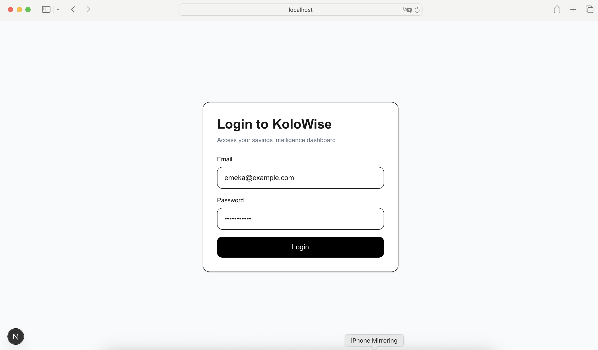
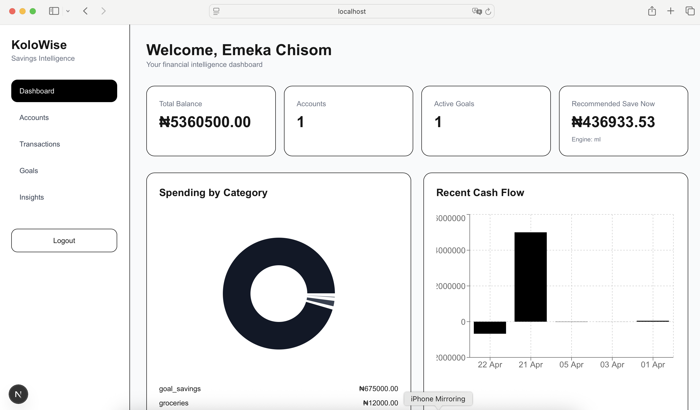
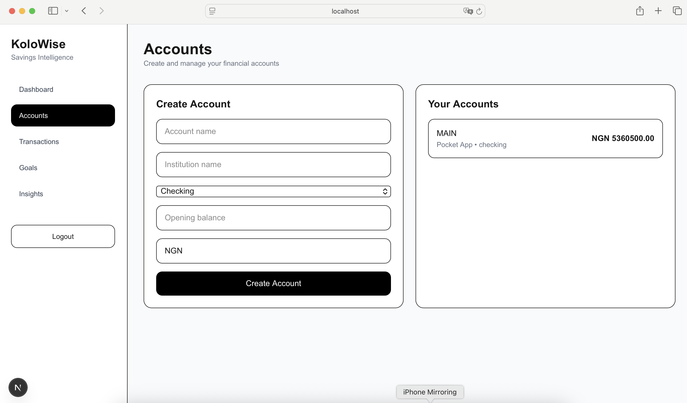
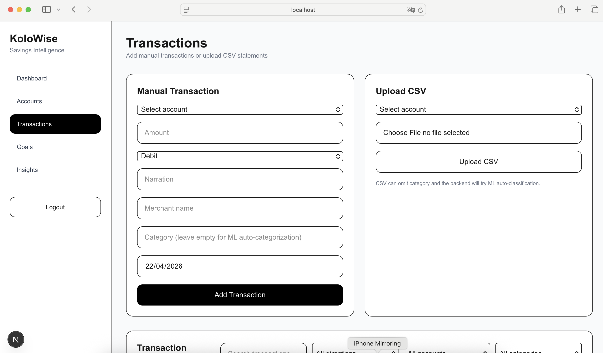
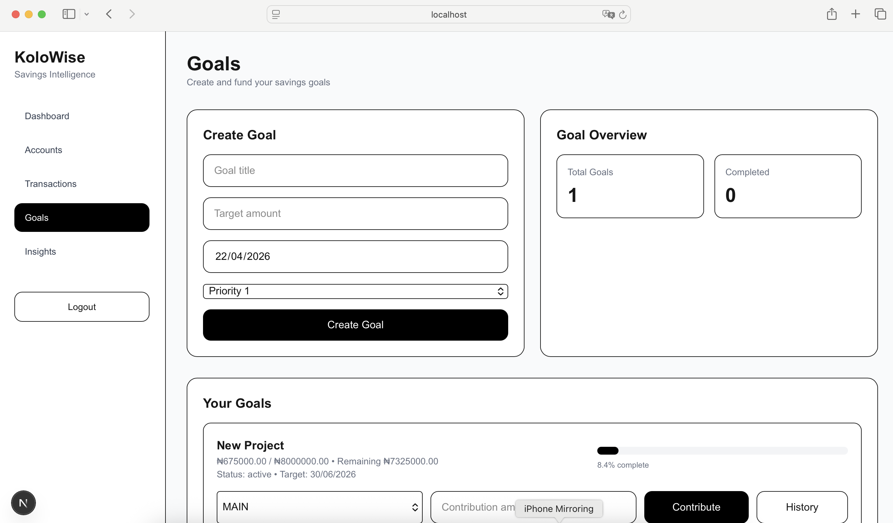
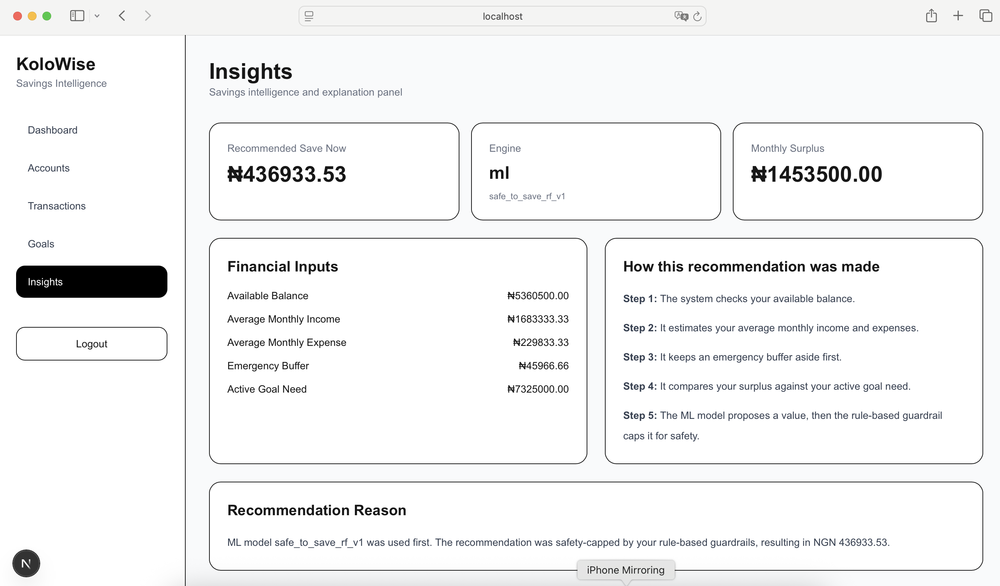

# KoloWise

KoloWise is an AI-powered personal finance and savings intelligence platform built as a monorepo. It helps users track transactions, create savings goals, upload statement CSVs, and receive machine-learning-assisted savings recommendations.

## Overview

KoloWise combines a Go backend, a Python ML microservice, and a Next.js frontend to provide a practical finance product with:
- account management
- transaction ingestion
- CSV import
- savings goal tracking
- contribution history
- ML-assisted transaction categorization
- ML-assisted safe-to-save recommendations with rule-based fallback

## Screenshots

### Login


### Dashboard


### Accounts


### Transactions



### Goals



### Insights


## Features

### Core finance features
- user authentication with JWT
- account creation and balance tracking
- manual transaction entry
- CSV transaction upload
- transaction listing, filtering, and search
- savings goal creation
- goal contribution tracking
- contribution history

### AI/ML features
- transaction category prediction
- safe-to-save recommendation model
- ML-first recommendation flow
- rule-based fallback when ML is unavailable

### Dashboard features
- total balance summary
- account overview
- active and completed goal count
- spending by category chart
- recent cash flow chart
- recent transaction feed
- savings explanation panel

## Monorepo structure

```text
.
├── apps
│   ├── api        # Go backend
│   ├── ml         # Python ML microservice
│   └── web        # Next.js frontend
├── docs
│   └── screenshots
├── infra
│   └── migrations
├── internal
├── pkg
├── docker-compose.prod.yml
├── nginx.conf
└── README.md